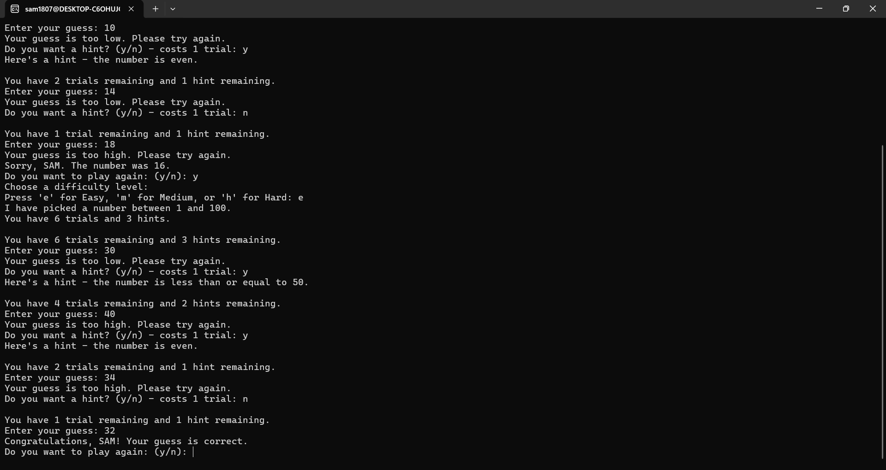

# Number Guessing Game

A terminal-based number guessing game written in C.

Pick a difficulty, guess the secret number, and use hints to narrow it
down before you run out of trials.

## How to play

    The game picks a secret number within the difficulty's range. You have
    a limited number of trials to guess it. After each wrong guess, you can
    spend a trial on a hint that reveals a property of the secret number.

    - **Easy** - numbers 1 to 100, 7 trials
    - **Medium** - numbers 1 to 500, 8 trials
    - **Hard** - numbers 1 to 1000, 9 trials

    Three hints are available per round. They're drawn in order of strength:
    the strongest hint is offered first, the weakest last. Each hint costs
    one trial.

    Guesses within 10 of the secret return "So close!" with a direction
    (higher or lower), so you get a nudge without the answer being given away.

## Building

    Requires `gcc` and `make`.

    make

    To clean up the build:

    make clean

## Running

    ./guess_game

## Project structure

    main.c      Entry point: seeds the RNG, runs the replay loop
    game.c      Game logic: rounds, guesses, hints, difficulty
    game.h      Function prototypes shared between source files
    Makefile    Build rules

## Implementation notes

    - Standard C89, compiled with `-Wall -Wextra -Werror -pedantic`
    - No dynamic memory allocation
    - Input handled with `fgets` and `scanf`, with explicit buffer clearing
    so that malformed input never traps the game in a loop
    - Hints are ordered by strength (primality and midpoint first, parity
            and divisibility last) so that spending a trial on one feels worthwhile

## Author

    SAM
